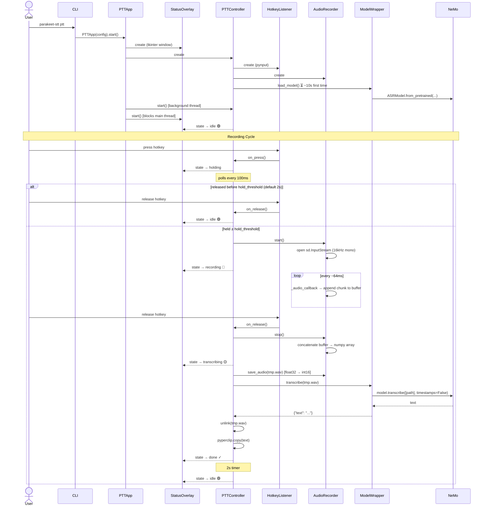
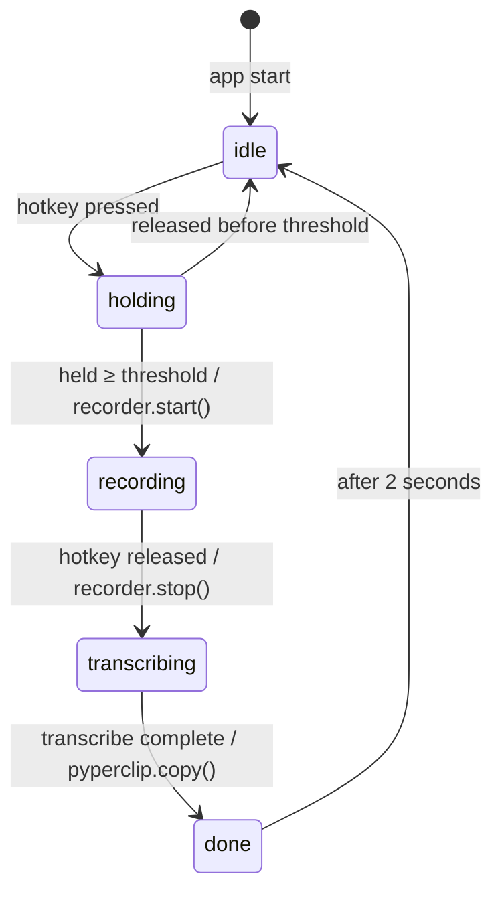
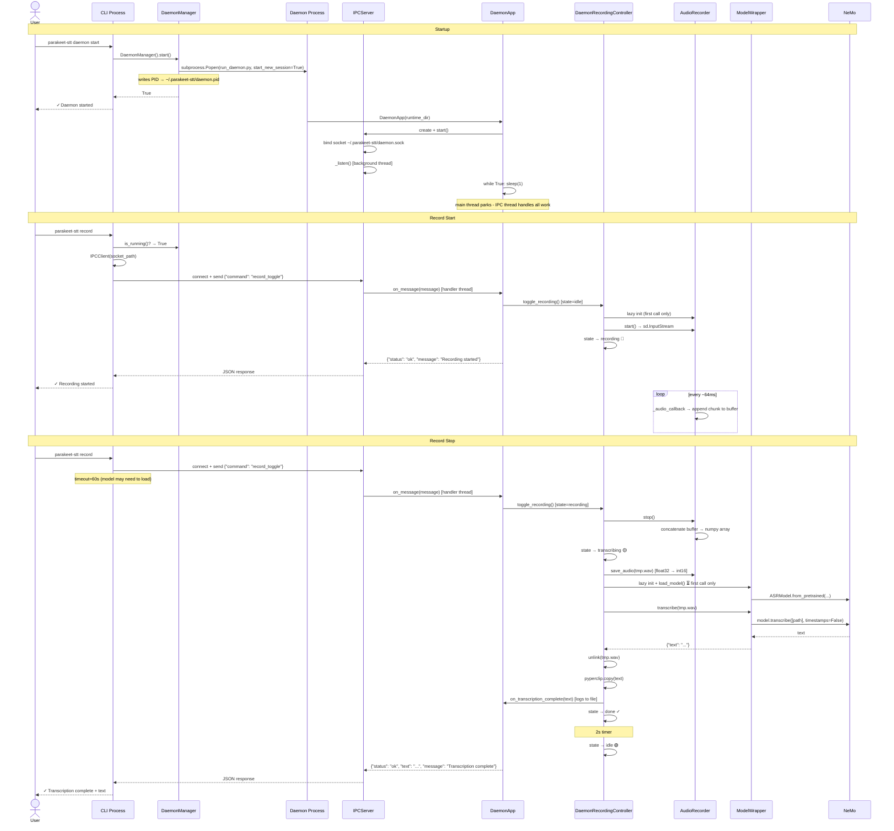
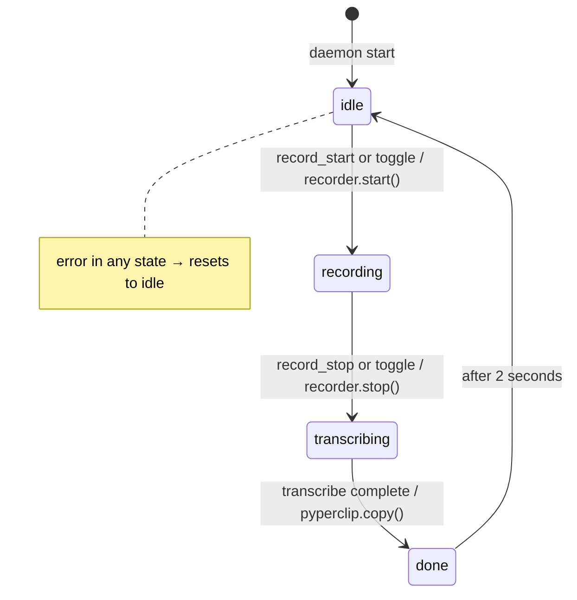

# Implementation Flows: PTT and Daemon Modes

> **Last Updated:** 2026-02-21
> **Scope:** Internal component interactions for push-to-talk (PTT) and daemon recording modes

---

## Overview

Both modes share the same audio recording and transcription pipeline but differ in how they are triggered and how they manage the model lifecycle.

| | PTT Mode | Daemon Mode |
|---|---|---|
| **Entry point** | `parakeet-stt ptt` | `parakeet-stt daemon start` |
| **Trigger** | Hold a hotkey | CLI command over Unix socket |
| **Process model** | Single foreground process | Persistent background subprocess |
| **Model loading** | Eager (on startup) | Lazy (on first `record stop`) |
| **Recorder init** | Eager (on startup) | Lazy (on first `record start`) |
| **UI feedback** | `StatusOverlay` (tkinter window) | Log file only (overlay disabled) |

---

## PTT Mode

### Sequence Diagram



### State Machine



---

## Daemon Mode

### Sequence Diagram

The daemon involves **two separate processes**: the short-lived CLI process that sends commands, and the persistent daemon process that executes them.



### State Machine (Daemon Controller)



---

## Shared Transcription Pipeline

Both modes funnel through the same pipeline once audio is captured:

```
AudioRecorder.stop()
        │
        ▼
  np.concatenate(buffer)          ← raw float32 numpy array
        │
        ▼
  AudioRecorder.save_audio()      ← convert float32 → int16, write .wav
        │
        ▼
  ModelWrapper.transcribe(path)
        │
        ▼
  Backend.transcribe(path)        ← NeMoBackend or MLXBackend
        │
        ▼
  model.transcribe([path],        ← full-file batch inference
      timestamps=False)           ← (no chunking; entire recording at once)
        │
        ▼
  {"text": "transcription..."}
        │
        ▼
  pyperclip.copy(text)            ← auto-copies to clipboard
```

---

## Key Differences in Model Lifecycle

### PTT Mode — Eager Loading
```
parakeet-stt ptt
    └─▶ PTTController.__init__()
            └─▶ ModelWrapper(config)     ← loads immediately on startup
                    └─▶ NeMo model loaded into memory (~2.4 GB)
                            └─▶ Ready before first recording
```

**Implication:** First keystroke is instant; startup takes ~10s.

### Daemon Mode — Lazy Loading
```
parakeet-stt daemon start
    └─▶ DaemonApp starts (fast, model NOT loaded)

parakeet-stt record        (first record start)
    └─▶ AudioRecorder lazy-init  ← happens here

parakeet-stt record        (first record stop)
    └─▶ ModelWrapper lazy-init   ← ~10s delay on first stop only
            └─▶ NeMo model loaded into memory
                    └─▶ All subsequent stops are fast
```

**Implication:** Daemon starts instantly; the first `record stop` has a ~10s delay for model loading.
